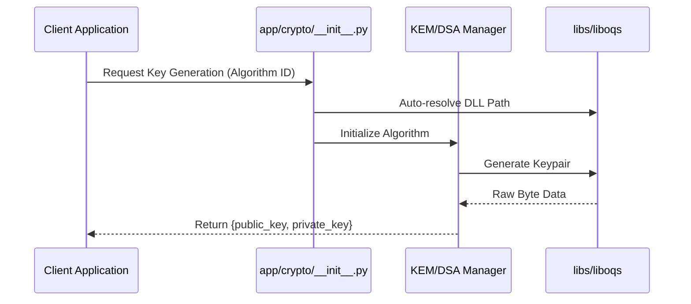
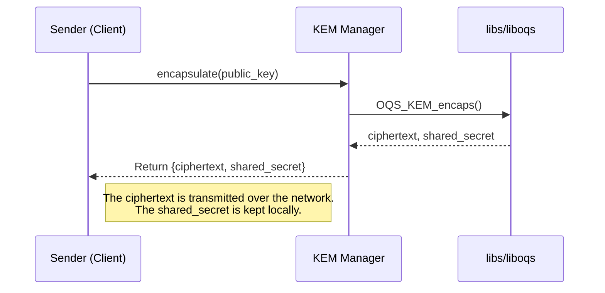
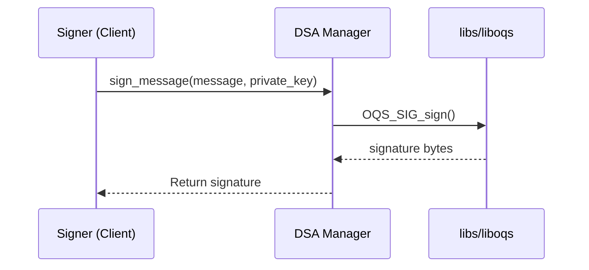
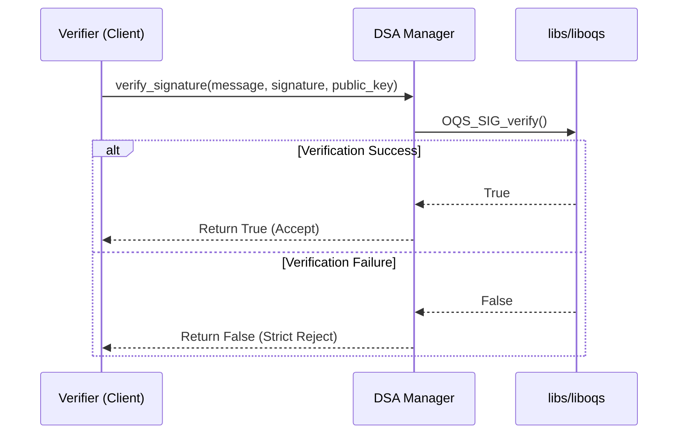

# QNNX-Sentinel Post-Quantum Cryptography Engine
**Standard Operating Procedures & Cryptographic Workflows**

This document outlines the standard workflows for the QNNX-Sentinel engine. All cryptographic operations utilize Post-Quantum algorithms loaded dynamically from the local `libs/liboqs` installation.

---

## 1. Key Generation Workflow
Generates secure public-private keypairs for either KEM or Digital Signatures.

---

## 2. Key Encapsulation Mechanism (KEM)
Securely encapsulates a shared cryptographic secret meant for a specific receiver.

---
## 3. Digital Signature (DSA)
Creates a tamper-proof post-quantum signature for a given message or payload.

---
## 4. Signature Verification
Validates a digital signature against a message and a public key. Security Note: Enforces a strict rejection policy for any verification failure or malformed data. 

